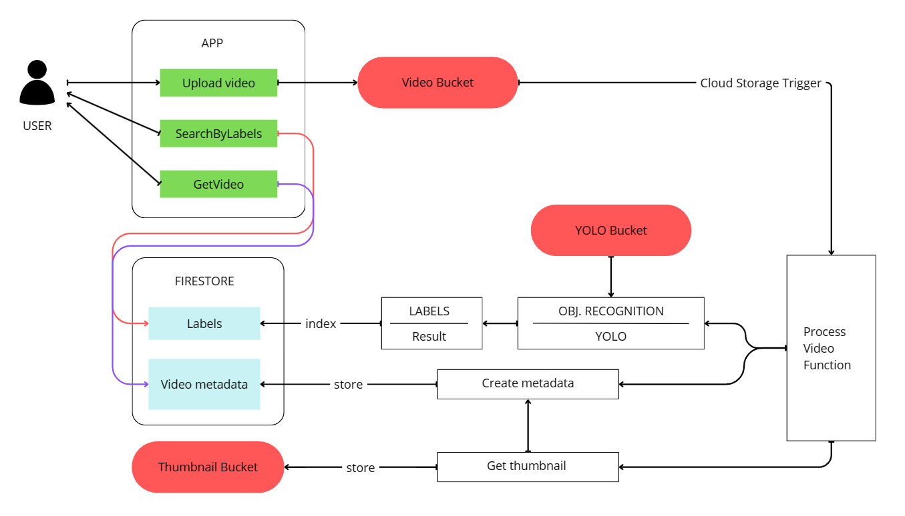
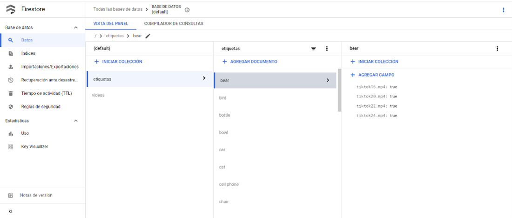

# Servicio de Streaming de Video en la Nube con Google Cloud Platform y YOLO

## Descripción

Este proyecto se centra en el desarrollo de un servicio de streaming de video en la nube mediante Google Cloud Platform, automatizando la carga, análisis y indexación de videos. Aprovechando las funciones de Google Cloud, el sistema procesa los videos cargados por los usuarios, detecta objetos y asigna etiquetas relevantes. Estas etiquetas, junto con las URLs del video y sus miniaturas, se almacenan eficientemente en Firestore. El pipeline utiliza tecnologías de visión por computadora y almacenamiento en la nube para gestionar contenido de video a gran escala.




### Buckets

- Cloud-videos: Se almacenan los videos de entrada.
- Cloud-imagenes: Almacena miniaturas para mejorar la experiencia de búsqueda.
- Yolov4model: Contiene los modelos YOLO y configuraciones.

### Firestore
- Metadata: Incluye etiquetas, nombre del video, URL de miniatura y enlace al video.
- Labels: Indice invertido clave[etiqueta]:ky[List[videos]] 



### Procesamiento de Video
Los usuarios cargan videos a través de la aplicación, desencadenando una función en Cloud Storage que inicia el pipeline de procesamiento.

- Obtención de archivos necesarios para YOLO desde Yolov4model.
- Captura del primer fotograma para representación visual rápida.
- Subida de la miniatura a cloud-imagenes para acceso y visualización.
- Inicialización del modelo YOLO y procesamiento de video fotograma por fotograma.
- Obtención de etiquetas.
- Guardar metadata en Metadata.
- Indexar video en Labels.

## Mobile App 


## WebApi

### `POST /api/upload`

**Descripción:**
Sube un archivo de video al bucket. El nombre del archivo se procesa para eliminar espacios, convertir a minúsculas y evitar duplicados.

**Parámetros de entrada:**
- `file` (tipo: IFormFile): El archivo de video que se va a subir.

**Respuestas:**
- `200 OK`: El archivo de video se subió exitosamente.
- `400 Bad Request`: Archivo no válido o formato de archivo incorrecto.

**Notas adicionales:**
- Se admite un conjunto específico de extensiones de archivo de video: `.mp4`, `.avi`, `.mkv`, `.mov`, `.wmv`.
- Se garantiza que los nombres de archivo no tengan espacios y sean únicos para evitar duplicados en el bucket.

### `GET /api/getAllVideos`

**Descripción:**
Obtiene metadatos de todos los videos almacenados en el servicio de almacenamiento en la nube.

**Respuestas:**
- `200 OK`: La solicitud se procesó correctamente y se devuelven los metadatos de los videos.
- `Response body`:
```
[
  {
    "etiquetas": [
      "string",
      "string"
    ],
    "miniaturaUrl": "string",
    "nombre": "string",
    "videoUrl": "string"
  },
]
```
- `400 Bad Request`: Error al procesar la solicitud.

### `GET /api/search/{text}`

**Descripción:**
Busca videos por etiquetas. Se procesa el texto de búsqueda para eliminar caracteres no alfanuméricos y convertir a minúsculas.

**Parámetros de entrada:**
- `text` (tipo: string): El texto de búsqueda que contiene las etiquetas.

**Respuestas:**
- `200 OK`: La búsqueda se realizó correctamente y se devuelven los metadatos de los videos encontrados.
- `Response body`:
```
[
  {
    "etiquetas": [
      "string",
      "string"
    ],
    "miniaturaUrl": "string",
    "nombre": "string",
    "videoUrl": "string"
  },
]
```
- `400 Bad Request`: El texto de búsqueda está vacío.
- `400 Bad Request`: Error al procesar la solicitud.

**Notas adicionales:**
- Se eliminan caracteres no alfanuméricos del texto de búsqueda.
- Se convierte el texto de búsqueda a minúsculas.


### `GET /api/getAllLabels`
**Descripción:** Obtiene todas las etiquetas del almacenamiento en la nube.

**Parámetros de entrada:** Ninguno

**Respuestas:**
  - Código 200 OK
    ```json
    [
        "Etiqueta1",
        "Etiqueta2",
        "Etiqueta3"
    ]
    ```
  - Código de error
    ```json
    {
        "Success": false,
        "ErrorMessage": "Error al procesar la solicitud."
    }
    ```
- **Notas adicionales:** Este endpoint devuelve todas las etiquetas disponibles en el almacenamiento en la nube.

### `GET /api/getLabels/{number}`
**Descripción:** Obtiene un número específico de etiquetas del almacenamiento en la nube.

**Parámetros de entrada:**
  - `{number}` (parámetro de ruta): El número de etiquetas a recuperar.

**Respuestas:**
  - Código 200 OK
    ```json
    [
        "Etiqueta1",
        "Etiqueta2",
        "Etiqueta3",
        "Etiqueta4",
        "Etiqueta5"
    ]
    ```
  - Código de error
    ```json
    {
        "Success": false,
        "ErrorMessage": "Error al procesar la solicitud."
    }
    ```
